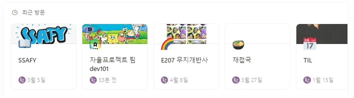

  

# 👋 YH dev ver.  👋

  <a href="https://streak-stats.demolab.com/?user=songjung-good" />
  

## 💬 Contact

### Notion

### Gmail

<!-- ###   -->

## ✨ 저의 깃허브는요

## 🌱 About Me
|**활동**|**기간**|**활동내용**|
|:---:|:---:|:---:|
|**ssafy 10기**|2023.07~2024.06(1년)|알고리즘 중심 코딩교육 & 프로젝트 기반 학습|
|**도서집필**|2020.10~2020.12(3개월)|'청년정책 뜯어보기'|
|**울산광역시의회**|2016.01~2016.12(10개월)|시정질의, 자유발언 등 초안 탈고|
|**울산대학교**|2015.03~2021.02(130학점)|경제학과 학사|

<!-- |군복무|2021.10~2023.04(18개월)|육군복무| -->
<!-- |노무현장학재단|2020.01~2020.12(1년)|장학생| -->

## 😄 진행프로젝트
|:CoA:|:cloth at hand:|:골라쥬:|
|------|---|---|
|::|||
|커밋 기반 프로젝트 분석 웹 프로젝트|옷 관리 및 데일리 룩 추천 IOT프로젝트|정보사회 속 선택의 질을 향상시키기 위한 웹 프로젝트|

## 👯 기술스택
<!--  -->

  
   
   
  
  
   
  
  
  
  
  
  
   
   
   
   

- python
- JavaScript
- TypeScript
- Next.js
- React

  
### 협업 툴
- Jira, git
- Mattermost, slack
- notion, google sheet, Figma
- discord, webex

<!-- ## ⚡ 자격증

+ SQLD(원함)
+ 정보처리기사(예정)
+ 
+ -->

