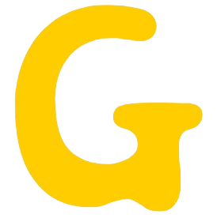

  

# 👋 YH

## ✨ MY Github
    

 

## 💬 Contact

  
  

 

<!-- ###   -->

 

## 🌱 About Me
<table>
  <thead>
    <tr>
      <th>활동</th>
      <th>기간</th>
      <th>활동내용</th>
    </tr>
  </thead>
  <tbody>
    <tr>
      <td style="text-align: center;"><strong>ssafy 10기</strong></td>
      <td style="text-align: center;">2023.07~2024.06(1년)</td>
      <td style="text-align: center;">알고리즘 중심 코딩교육 & 프로젝트 기반 학습</td>
    </tr>
    <tr>
      <td style="text-align: center;"><strong>도서집필</strong></td>
      <td style="text-align: center;">2020.10~2020.12(3개월)</td>
      <td style="text-align: center;">'청년정책 뜯어보기'</td>
    </tr>
    <tr>
      <td style="text-align: center;"><strong>울산광역시의회</strong></td>
      <td style="text-align: center;">2016.01~2016.12(10개월)</td>
      <td style="text-align: center;">시정질의, 자유발언 등 초안 탈고</td>
    </tr>
    <tr>
      <td style="text-align: center;"><strong>울산대학교</strong></td>
      <td style="text-align: center;">2015.03~2021.02(130학점)</td>
      <td style="text-align: center;">경제학과 학사</td>
    </tr>
  </tbody>
</table>

<!-- |군복무|2021.10~2023.04(18개월)|육군복무| -->
<!-- |노무현장학재단|2020.01~2020.12(1년)|장학생| -->

 

## 😄 진행프로젝트
<table style="width: 100%; table-layout: fixed; border-collapse: collapse;">
  <tr>
    <th style="text-align: center;">CoA</th>
    <th style="text-align: center;">Cloth at Hand</th>
    <th style="text-align: center;">골라쥬</th>
  </tr>
  <tr>
    <td style="text-align: center; vertical-align: middle;">
      
    </td>
    <td style="text-align: center; vertical-align: middle;">
      
    </td>
    <td style="text-align: center; vertical-align: middle;">
      
    </td>
  </tr>
  <tr>
    <td style="text-align: center;">커밋 기반 프로젝트 분석 웹 프로젝트</td>
    <td style="text-align: center;">옷 관리 및 데일리 룩 추천 IOT 프로젝트</td>
    <td style="text-align: center;">정보사회 속 선택의 질을 향상시키기 위한 웹 프로젝트</td>
  </tr>
</table>

 

## 👯 기술스택
<!--  -->

  
   
   
  
  
   
  
  
  
  
  
  
   
   
   
   

+ 언어 : python, javascript, typescript, dart
+ 프레임워크 및 라이브러리 : react, vue3, flutter, reactnative, next.js, django
+ CSS관련 : bootstrap, tailwindcss, styled-components
+ 개발도구 : vscode, android studio, postman
+ 데이터베이스 : mysql
+ 클라우드 및 협업도구 : aws, github, gitlab, figma, gerrit, swager, jira

 

⚡ 자격증
+ SQLD
